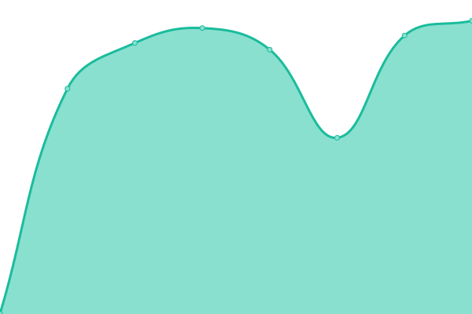

# [📈 Live Status](https://demo.upptime.js.org): <!--live status--> **🟧 Partial outage**

This repository contains the open-source uptime monitor and status page for [Upptime](https://upptime.js.org), powered by [Upptime](https://github.com/upptime/upptime).

With [Upptime](https://upptime.js.org), you can get your own unlimited and free uptime monitor and status page, powered entirely by a GitHub repository. We use [Issues](https://github.com/upptime/upptime/issues) as incident reports, [Actions](https://github.com/lksjames/monitoring/actions) as uptime monitors, and [Pages](https://demo.upptime.js.org) for the status page.

<!--start: status pages-->
<!-- This summary is generated by Upptime (https://github.com/upptime/upptime) -->
<!-- Do not edit this manually, your changes will be overwritten -->
<!-- prettier-ignore -->
| URL | Status | History | Response Time | Uptime |
| --- | ------ | ------- | ------------- | ------ |
|  [이마트 store.emart.com](https://store.emart.com) | 🟩 Up | [store-emart-com.yml](https://github.com/lksjames/monitoring/commits/HEAD/history/store-emart-com.yml) | 

 829ms
     
 | 

<a href="https://lksjames.github.io/monitoring/history/store-emart-com">100.00%</a>
    

|  [신세계닷컴 www.shinsegae.com](http://www.shinsegae.com) | 🟩 Up | [www-shinsegae-com.yml](https://github.com/lksjames/monitoring/commits/HEAD/history/www-shinsegae-com.yml) | 

 1355ms
     
 | 

<a href="https://lksjames.github.io/monitoring/history/www-shinsegae-com">100.00%</a>
    

|  [에브리데이 www.emarteveryday.co.kr](http://www.emarteveryday.co.kr) | 🟩 Up | [www-emarteveryday-co-kr.yml](https://github.com/lksjames/monitoring/commits/HEAD/history/www-emarteveryday-co-kr.yml) | 

 1157ms
     
 | 

<a href="https://lksjames.github.io/monitoring/history/www-emarteveryday-co-kr">100.00%</a>
    

|  [신세계 인터내셔날 www.sikorea.co.kr](http://www.sikorea.co.kr) | 🟥 Down | [www-sikorea-co-kr.yml](https://github.com/lksjames/monitoring/commits/HEAD/history/www-sikorea-co-kr.yml) | 

 0ms
     
 | 

<a href="https://lksjames.github.io/monitoring/history/www-sikorea-co-kr">0.00%</a>
    

|  [신세계L&B www.shinsegae-lnb.com](http://www.shinsegae-lnb.com) | 🟩 Up | [l-and-b-www-shinsegae-lnb-com.yml](https://github.com/lksjames/monitoring/commits/HEAD/history/l-and-b-www-shinsegae-lnb-com.yml) | 

 1941ms
     
 | 

<a href="https://lksjames.github.io/monitoring/history/l-and-b-www-shinsegae-lnb-com">100.00%</a>
    

|  [신세계아이앤씨 www.shinsegae-inc.com](http://www.shinsegae-inc.com) | 🟩 Up | [www-shinsegae-inc-com.yml](https://github.com/lksjames/monitoring/commits/HEAD/history/www-shinsegae-inc-com.yml) | 

 1610ms
     
 | 

<a href="https://lksjames.github.io/monitoring/history/www-shinsegae-inc-com">100.00%</a>
    

|  [조선호텔 www.josunhotel.com](http://www.josunhotel.com) | 🟩 Up | [www-josunhotel-com.yml](https://github.com/lksjames/monitoring/commits/HEAD/history/www-josunhotel-com.yml) | 

 6370ms
     
 | 

<a href="https://lksjames.github.io/monitoring/history/www-josunhotel-com">100.00%</a>
    

|  [신세계사이먼 www.premiumoutlets.co.kr](https://www.premiumoutlets.co.kr) | 🟩 Up | [www-premiumoutlets-co-kr.yml](https://github.com/lksjames/monitoring/commits/HEAD/history/www-premiumoutlets-co-kr.yml) | 

 2304ms
     
 | 

<a href="https://lksjames.github.io/monitoring/history/www-premiumoutlets-co-kr">100.00%</a>
    

|  [신세계그룹 www.shinsegaegroupnewsroom.com](https://www.shinsegaegroupnewsroom.com) | 🟩 Up | [www-shinsegaegroupnewsroom-com.yml](https://github.com/lksjames/monitoring/commits/HEAD/history/www-shinsegaegroupnewsroom-com.yml) | 

 1295ms
     
 | 

<a href="https://lksjames.github.io/monitoring/history/www-shinsegaegroupnewsroom-com">100.00%</a>
    

|  [이마트24 www.emart24.co.kr](https://www.emart24.co.kr) | 🟩 Up | [24-www-emart24-co-kr.yml](https://github.com/lksjames/monitoring/commits/HEAD/history/24-www-emart24-co-kr.yml) | 

 2570ms
     
 | 

<a href="https://lksjames.github.io/monitoring/history/24-www-emart24-co-kr">100.00%</a>
    

|  [자유CC www.jayucc.co.kr](https://www.jayucc.co.kr) | 🟩 Up | [cc-www-jayucc-co-kr.yml](https://github.com/lksjames/monitoring/commits/HEAD/history/cc-www-jayucc-co-kr.yml) | 

 1726ms
     
 | 

<a href="https://lksjames.github.io/monitoring/history/cc-www-jayucc-co-kr">100.00%</a>
    

|  [스타벅스 www.starbucks.co.kr](https://www.starbucks.co.kr) | 🟩 Up | [www-starbucks-co-kr.yml](https://github.com/lksjames/monitoring/commits/HEAD/history/www-starbucks-co-kr.yml) | 

 2486ms
     
 | 

<a href="https://lksjames.github.io/monitoring/history/www-starbucks-co-kr">100.00%</a>
    

|  [까사미아 www.guud.com](http://www.guud.com) | 🟩 Up | [www-guud-com.yml](https://github.com/lksjames/monitoring/commits/HEAD/history/www-guud-com.yml) | 

 4680ms
     
 | 

<a href="https://lksjames.github.io/monitoring/history/www-guud-com">100.00%</a>
    

|  [신세계푸드 www.shinsegaefood.com](http://www.shinsegaefood.com) | 🟩 Up | [www-shinsegaefood-com.yml](https://github.com/lksjames/monitoring/commits/HEAD/history/www-shinsegaefood-com.yml) | 

 1662ms
     
 | 

<a href="https://lksjames.github.io/monitoring/history/www-shinsegaefood-com">100.00%</a>
    

|  [스타필드 www.starfield.co.kr](http://www.starfield.co.kr) | 🟩 Up | [www-starfield-co-kr.yml](https://github.com/lksjames/monitoring/commits/HEAD/history/www-starfield-co-kr.yml) | 

 1985ms
     
 | 

<a href="https://lksjames.github.io/monitoring/history/www-starfield-co-kr">100.00%</a>
    

|  [면세점몰 www.ssgdfm.com](http://www.ssgdfm.com) | 🟩 Up | [www-ssgdfm-com.yml](https://github.com/lksjames/monitoring/commits/HEAD/history/www-ssgdfm-com.yml) | 

 2553ms
     
 | 

<a href="https://lksjames.github.io/monitoring/history/www-ssgdfm-com">100.00%</a>
    

|  [SSG.COM www.ssg.com](http://www.ssg.com) | 🟩 Up | [ssg-com-www-ssg-com.yml](https://github.com/lksjames/monitoring/commits/HEAD/history/ssg-com-www-ssg-com.yml) | 

 3600ms
     
 | 

<a href="https://lksjames.github.io/monitoring/history/ssg-com-www-ssg-com">100.00%</a>
    

|  [Goodmd total.good-md.com:5280](https://total.good-md.com:5280) | 🟩 Up | [goodmd-total-good-md-com-5280.yml](https://github.com/lksjames/monitoring/commits/HEAD/history/goodmd-total-good-md-com-5280.yml) | 

 977ms
     
 | 

<a href="https://lksjames.github.io/monitoring/history/goodmd-total-good-md-com-5280">88.40%</a>
    

|  [신세계 프라퍼티 www.shinsegaeproperty.com](http://www.shinsegaeproperty.com) | 🟩 Up | [www-shinsegaeproperty-com.yml](https://github.com/lksjames/monitoring/commits/HEAD/history/www-shinsegaeproperty-com.yml) | 

 451ms
     
 | 

<a href="https://lksjames.github.io/monitoring/history/www-shinsegaeproperty-com">100.00%</a>
    

|  [접속실패 테스트 www.google.com](http://www.google.com) | 🟩 Up | [www-google-com.yml](https://github.com/lksjames/monitoring/commits/HEAD/history/www-google-com.yml) | 

 77ms
     
 | 

<a href="https://lksjames.github.io/monitoring/history/www-google-com">100.00%</a>
    

<!--end: status pages-->

[**Visit our status website →**](https://demo.upptime.js.org)

## 📄 License

- Powered by: [Upptime](https://github.com/upptime/upptime)
- Code: [MIT](./LICENSE) © [Upptime](https://upptime.js.org)
- Data in the `./history` directory: [Open Database License](https://opendatacommons.org/licenses/odbl/1-0/)
